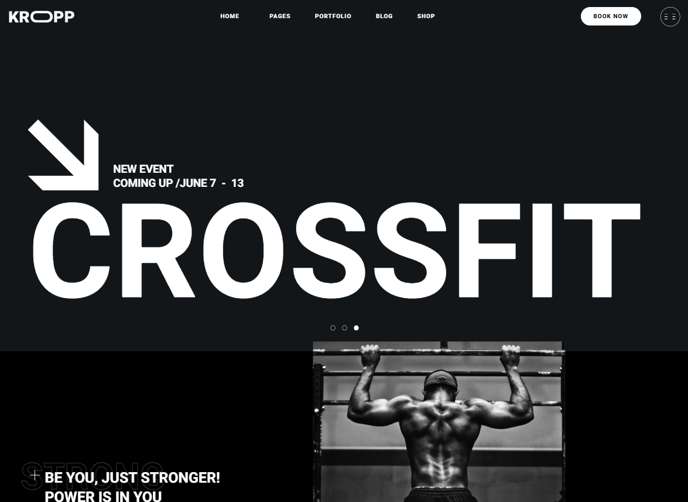
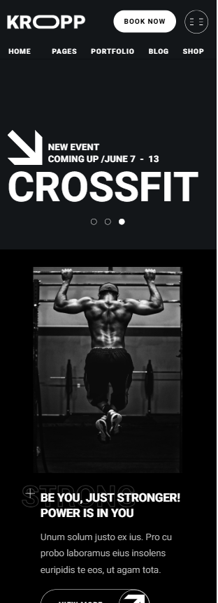

# 🏋️‍♂️ Kropp Fitness (учебный проект)

---

Этот проект создан в ходе повторения мастер-класса фронтенд-разработчика [Aleksander Lamkov](https://github.com/aleksanderlamkov).  
Оригинальная структура верстки принадлежат автору урока.  
Я воспроизвел сайт для практики и внес собственные улучшения.

---

## 🔗 Live Demo
👉 [https://whalter26.github.io/Kropp-Fitness/]

---

## 🧱 Технологии

- **HTML5** — семантическая структура  
- **CSS3** — Flexbox, Grid, Custom Properties, `clamp()`, `aspect-ratio`  
- **Адаптивная верстка** — от 1920px до 402px  
- **Шрифты** — подключены локально через `@font-face`  
- **SVG-иконки** и фоновые изображения  

---

## ✨ Мои доработки

- ✅ Добавлена встроенная **Google-карта** в блоке с локацией.  
- ✅ Создан дополнительный **брейкпоинт 402px** для лучшей адаптации на очень узких экранах.  
- ✅ Скорректированы некоторые отступы, размеры шрифтов и сетка в мобильной версии.  

---

## 🖼 Preview

<table width="100%">
  <tr>
    <td width="65%" align="center" valign="top">
      <h3>🖥 Desktop</h3>
      
    </td>
    <td width="35%" align="center" valign="top">
      <h3>📱 Mobile</h3>
      
    </td>
  </tr>
</table>

🔍 Посмотреть страницу целиком (Full page preview)

 

---
